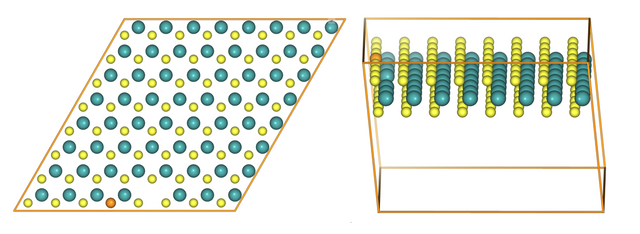
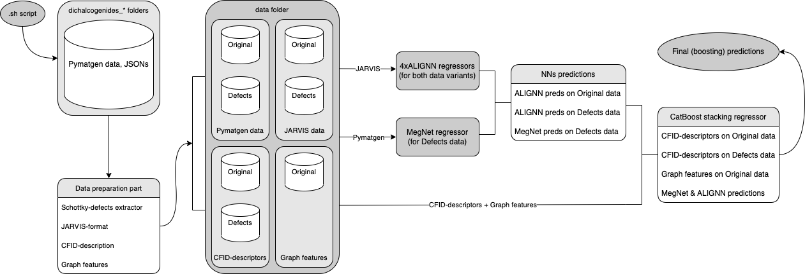

# 📈 [International Data Analysis Olympiad](https://idao.world/)
## 👯 Team: NESCafé Gold 3in1
We present networks, weights and stacking algorithms for our third place solutions in [IDAO 2022](https://idao.world/).

## 🔖 Contents
- [👾 Team members](https://github.com/yk4r2/idao_22#-team-members)
- [🔗 Citation](https://github.com/yk4r2/idao_22#-citation)
- [👀 Overview](https://github.com/yk4r2/idao_22#-overview)
  - [⏰ Abstract](https://github.com/yk4r2/idao_22#-abstract)
  - [🥋 Task](https://github.com/yk4r2/idao_22#-task)
- [💿 Data](https://github.com/yk4r2/idao_22#-data)
  - [🔐 Original data structure](https://github.com/yk4r2/idao_22#-original-data-structure)
  - [🍀 Our data structure](https://github.com/yk4r2/idao_22#-our-data-structure)
- [⚙️ Method](https://github.com/yk4r2/idao_22#-method)
  - [🪜 Steps](https://github.com/yk4r2/idao_22#-steps)
  - [🚗 Specs](https://github.com/yk4r2/idao_22#-specs)
  - [☁ Cloud notebooks and datasets](https://github.com/yk4r2/idao_22#-cloud-notebooks-and-datasets)
- [🏆 Results](https://github.com/yk4r2/idao_22#-results)
- [🛠 Installation and Dependencies](https://github.com/yk4r2/idao_22#-installation-and-dependencies)
- [🏗 Structure](https://github.com/yk4r2/idao_22#-structure)

## 👾 Team members
- [Egor Zhestow, yk4r2](https://github.com/yk4r2)
- [Daniil Buchko, danyanyam](https://github.com/danyanyam)
- [Sungatullin Ruslan, sunruslan](https://github.com/sunruslan)

## 🔗 Citation
It's empty here for now.

## 👀 Overview
### ⏰ Abstract
Two-dimensional transition metal dichalcogenides (TMDCs) are relatively new and currently unexamined. These materials can contain naturally-occuring defects, that are extremely important for materials properties and performance. Predicting the band gap (energy difference between the valence band and conduction band) is extremely important for understanding the conducting properties of materials. In semi-finals of an [International Data Analysis Olympiad 2022](https://idao.world/) participants were asked to create both high-performant and fast algorithms that would be able to predict the materials' band gap from its molecular structure. Our team finished third and in this work we share the description of our approach, networks weights and code that is sufficient for inference.

### 🥋 Task


Two-dimensional transition metal dichalcogenides (TMDCs) are relatively new types of materials that have remarkable properties ranging from semiconducting, metallic, magnetic, superconducting to optical. The chemical composition of TMDCs is MX₂; where M is the group of transition elements most popular Molybdenum and Tungsten, and X is usually Sulfur or Selenium. Atomically thin TMDCs usually contain various defects, which enrich the lattice structure and give rise to many intriguing properties. Engineered point defects in two-dimensional (2D) materials offer an attractive platform for solid-state devices that exploit tailored optoelectronic, quantum emission, and resistive properties. Naturally occurring defects are also unavoidably important contributors to material properties and performance. The immense variety and complexity of possible defects make it challenging to experimentally control, probe, or understand atomic-scale defect-property relationships. In the figure above you can find vacancy and substitution defects in an 8x8 MoS₂ crystal lattice.

Band gap is one of the important physical attributes which describe certain characteristics of the material, that helps deriving material qualities including electric conductivity or catalytic power or photo-optical properties. Band gap is the energy difference between the valence band and conduction band and is closely related to the energy difference between highest occupied molecular orbital (HOMO) and lowest unoccupied molecular orbital (LUMO), materials with overlapping (between valence band and conduction band) or very small band gap are conductors and materials with small bandgap are semiconductors while materials with large bandgap are insulators.

**The task is to predict band gap energy for each crystal structure.**

#### Quality Metric

Energy within Threshold (EwT) is designed to measure the practical usefulness of a model for replacing [DFT](https://en.wikipedia.org/wiki/Density_functional_theory) by evaluating whether the predicted energy is close to the ground truth (DFT energy). EwT is defined as the fraction of structures in which the predicted energy is within `0.02 eV` ([electronvolt](https://en.wikipedia.org/wiki/Electronvolt)) of the ground truth energy.

## 💿 Data
### 🔐 Original data structure
The training dataset is in the `data` directory in the baseline and structured into a directory called `structures` containing 2967 crystal structures as a json file named with a unique identifier and is containing a special pymatgen structure (check pymatgen documentation for [reference](https://pymatgen.org/index.html)), that contains information about crystal parameters, cartesian coordinates of each atom, atom types, and other information.

The targets are stored in a csv file named `targets.csv` containing two columns; the first is the unique identifier of the structure and the other is the band gap value for each structure. The train and test sets are constructed by sampling the corresponding subset without replacement.

Train/test samples:
- The training sample contains 1796 examples.
- The public test sample contains 1484 examples.
- The private test sample contains 1483 examples.

```bash
data
├── dichalcogenides_private
│   └── structures
│	    ├── 6149087231cf3ef3d4a9f848.json
│	    ├── 6149c48031cf3ef3d4a9f84a.json
│	    └──...
└── dichalcogenides_public
    ├── structures
    │	├── 6146dd853ac25c70a5c6cdeb.json
    │	├── 6146e9103ac25c70a5c6cded.json
    │	└── ...
    └── targets.csv
```

### 🍀 Our data structure
The training dataset is in the `data` directory, and contains `eval` (private) and `train` (public) directories. Inside them one can find `defects` and `no_defects` folders, original structures in different formats are stored at `no_defects` directory while `defects` directory contains complement to the original crystal lattice.\
Inside the `defects` and `no_defects` directories one can find original data in pymatgen-format, jarvis-adapted structures, CFID-descripted structures (for more info check out [its source code](https://t.ly/yCyi)) and graph features (only for `no_defects`-directories, for more info check out `adhoc/scripts/graph_features.py:19`).
```bash
data
├── eval
│   ├── defects
│   │   ├── cfid
│   │   │   └── eval.csv
│   │   ├── cifs
│   │   │   ├── 6149087231cf3ef3d4a9f848.cif
│   │   │   ├── 6149c48031cf3ef3d4a9f84a.cif
│   │   │   ├── ...
│   │   │   └── atom_init.json
│   │   ├── jarvis
│   │   │   ├── 6149c48031cf3ef3d4a9f84a.vasp
│   │   │   ├── 6149f3853ac25c70a5c6ce01.vasp
│   │   │   └── ...
│   │   └── pymatgen
│   │       ├── 6149087231cf3ef3d4a9f848.json
│   │       ├── 6149c48031cf3ef3d4a9f84a.json
│   │       └──...
│   ├── no_defects
│   │   ├── cfid
│   │   │   └── eval.csv
│   │   ├── cifs
│   │   │   ├── 6149087231cf3ef3d4a9f848.cif
│   │   │   ├── 6149c48031cf3ef3d4a9f84a.cif
│   │   │   ├── ...
│   │   │   └── atom_init.json
│   │   ├── graph
│   │   │   └── eval.csv
│   │   ├── jarvis
│   │   │   ├── 6149c48031cf3ef3d4a9f84a.vasp
│   │   │   ├── 6149f3853ac25c70a5c6ce01.vasp
│   │   │   └── ...
│   │   └── pymatgen
│   │       ├── 6149087231cf3ef3d4a9f848.json
│   │       ├── 6149c48031cf3ef3d4a9f84a.json
│   │       └──...
└── train
    ├── defects
    │   ├── cfid
    │   │   └── train.csv
    │   ├── cifs
    │   │   ├── 6146dd853ac25c70a5c6cdeb.cif
    │   │   ├── 6146e9103ac25c70a5c6cded.cif
    │   │   ├── ...
    │   │   └── atom_init.json
    │   ├── graph
    │   │   └── train.csv
    │   ├── jarvis
    │   │   ├── 6146dd853ac25c70a5c6cdeb.vasp
    │   │   ├── 6146e9103ac25c70a5c6cded.vasp
    │   │   └── ...
    │   └── pymatgen
    │       ├── 6146dd853ac25c70a5c6cdeb.json
    │       ├── 6146e9103ac25c70a5c6cded.json
    │       └──...
    └── no_defects
        ├── cfid
        │   └── eval.csv
        ├── cifs
        │   ├── 6146dd853ac25c70a5c6cdeb.cif
        │   ├── 6146e9103ac25c70a5c6cded.cif
        │   ├── ...
        │   └── atom_init.json
        ├── jarvis
        │   ├── 6146dd853ac25c70a5c6cdeb.vasp
        │   ├── 6146e9103ac25c70a5c6cded.vasp
        │   └── ...
        └── pymatgen
            ├── 6146dd853ac25c70a5c6cdeb.json
            ├── 6146e9103ac25c70a5c6cded.json
            └──...
```

## ⚙️ Method
### 🪜 Steps

The original [ALIGNN](https://github.com/usnistgov/alignn) and [MEGNet](https://github.com/materialsvirtuallab/megnet) frameworks were fine-tuned and used in a following way:
- We described the data using CFID descriptor from the [JARVIS-ML package](https://github.com/usnistgov/jarvis), source code is [here](https://t.ly/yCyi).
- Secondly we used complements to our structures for predictions (Schottky defects). We computed complement structures (code in `adhoc/scripts/atoms_to_defects.py`) for future steps.
- Next, some graph features from [networkx.algorithms](https://networkx.org/documentation/stable/reference/algorithms/index.html) package were computed. See the `adhoc/scripts/graph_features.py` and functions documentation for more info.
- Afterwards we tuned twice 4 pre-trained ALIGNN Nets on pymatgen-adapted data using Google Colab, starting models can be found in the `models/ALIGNN/pretrained` directory. Resulting models are in the `models/ALIGNN/fine-fine-tuned` directory and ALIGNN was [forked](https://github.com/yk4r2/alignn) for better usability.
- Then we tuned 4 pre-trained ALIGNN models for complementary structures data. Resulting models are in `models/ALIGNN/defects`.
- Then MEGNet was trained on complement structures only and CFID-descriptors for complement structures were computed too.
- 8 ALIGNN Nets (for structures and complements) predictions were calculated, mixed with MegNet predictions and given to [CatBoostRegressor](https://catboost.ai/en/docs/concepts/python-reference_catboostregressor) along with graph features and descriptors...
...PROFIT!

### 🚗 Specs
- Google Colab Pro+ with Tesla V100 for ALIGNN train and inference,
- MacBook PRO 2019 CPU (1.4 GHz Quad-Core Intel Core i5) for MEGNet train, inference and for CatBoost inference,
- Kaggle CPU for CatBoost train.

### ☁ Cloud notebooks and datasets
- [Colab notebook](https://colab.research.google.com/drive/1NZhOvrt8FKLhnZgiQzNDuF2NApU2E0al?usp=sharing) with [ALIGNN](https://github.com/usnistgov/alignn) fine-tuning and inference.
- [Colab notebook](https://colab.research.google.com/drive/1dSpGZz-TYmOxv9xH2A65kMdPb1XtMEQp?usp=sharing) with ALIGNN inference.
- [Colab notebook](https://colab.research.google.com/drive/1V3cAuli1yd3ZCP7WJ77XBKBSofeodwQ_?usp=sharing) with datasets download scripts (jrom [jarvis](https://github.com/usnistgov/jarvis)), unused in final submission.
- [Big dataset for Track 1 on Kaggle](https://www.kaggle.com/yk4r22/idao-22) with features and predictions for gradient boosting.
- [Notebook for Track 1 on Kaggle](https://www.kaggle.com/yk4r22/idao-tries): stacking ALIGNN and MegNet regressors using self-made graph features by @sunruslan and [jarvis CFID descriptor](https://jarvis-materials-design.github.io/dbdocs/jarvisml/).
- [Downsized dataset for Track 2 on Kaggle](https://jarvis-materials-design.github.io/dbdocs/jarvisml/) with graph features and CFID-descriptors for mixing with MegNet, used for training final model on Track 2.
- [Notebook for Track 2 on Kaggle](https://www.kaggle.com/yk4r22/catboost-track2) for boosting training over MegNet predictions and Track 2 dataset features. For more information about stacking method check the [Track 2 branch](https://github.com/yk4r2/idao_22/tree/final/track2).

## 🏆 Results
Result on the public and private leaderboard with respect to the metric that was used by the organizers of the [IDAO 2022](https://idao.world/).

LB Results:\
| A score | A_pub | A_private | B score | B_pub | B_private | Total |
|---------|-------|-----------|---------|-------|-----------|-------|
| 0.923   | 0.933 | 0.923     | 0.929   | 0.930 | 0.929     | 1.952 |

Which is TOP-3 overall, TOP-3 for track 2 and TOP-5 for track 1.

## 🛠 Installation and Dependencies
- `python` 3.9.6
- `pyenv` from [here](https://github.com/pyenv/pyenv)
- `poetry`: ```pip install poetry```
- all the needed packages from `pyproject.toml` and your own `venv`:
    - ```pyenv install 3.9.6 && pyenv local 3.9.6```
    - `poetry` instruction can be found [here](https://blog.jayway.com/2019/12/28/pyenv-poetry-saviours-in-the-python-chaos/)
    - ```poetry update```
- `pyproject.toml` or `requirements.txt` with dependencies needed.
- initialize the pre-commit hook with ```poetry run pre-commit install```
- you can find the `get_data.sh` script in the `data/` folder: ```cd data/ && /bin/bash get_data.sh```


## 🏗 Structure
- `ad-hoc`: a directory for notebooks and ad-hoc scripts.
    - Contains everybody's sandboxes.
    - `scripts`: a directory for models and training scripts.
        - Please create separate branches for any hypothesis you have.
    - `edas`: Exploratory Data Analysis notebooks.
    - `trainPreds4EDA`: useful predictions on train for the further research purposes.
- `data`: a directory for datasets.
- `configs`: unused directory with ALIGNN and MEGNet configuration files samples.
- `images`: service directory for READMEs.
- `models`: directory with ALIGNN and MEGNet model weights.
- `predictions`: stored predictions from ALIGNN, MEGNet and CatBoost.
