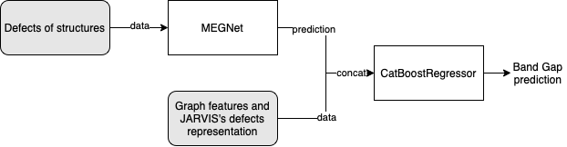
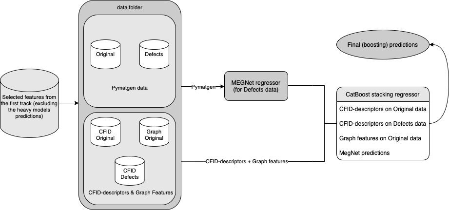

# 📈 [International Data Analysis Olympiad](https://idao.world/)

Current python version: 3.9.6
# Usage
To prepare solution for submission, execute the following code, which will create ```track_2_submission.zip```:
```bash
make zip
```
To create ```submission.csv``` execute the next command:
```bash
make
```


# Description
## Content
Together with the code, we upload the following data to the second track:

- Handpicked graph features
- Defects of the structures in pymatgen format
- CFID descriptors of defects
- Boosting's weights
- MEGNet's weights

Then we use `MEGNet` to predict band gap on structures of defects. Next, we use its prediction together with abovementioned features to obtain final prediction. We do not use prediction of heavy models (such as `ALIGNN`) as features on this track. Overall pipeline, described in [generate_submission.py](generate_submission.py), can be seen generally on the image below:



## Project Structure

```
idao_22
│   generate_submission.py
│   config.yaml
│
└───data
│   	...
│
└───notebooks
│   	features_selection_boosting.ipynb
│   	...
│
└───weights
    	boosting.cbm
    	val_mae_00750_0.010320.hdf5
```

## Models used

- `MEGNet` (to generate features used in boosting)
- `CatBoostRegressor` (to generate band gap prediction)

## Features usage

List of all features, used in the final prediction can be viewed at [notebooks/catboost_features.json](https://github.com/yk4r2/idao_22/blob/final/track2/notebooks/catboost_features.json). It includes prediction of the MEGNet model trained on defects only, different graph features and JARVIS descriptors. To sum everything up here is a picture of the data used in the second track.


## Data mining
Here are links for features extraction and models training that we performed in order to use in the solution

- [Graph features extraction](https://github.com/yk4r2/idao_22/blob/master/adhoc/scripts/graph_features.py)
- [Defects extraction](notebooks/atoms_to_defects.ipynb)
- [CFID descriptors of defects](https://github.com/yk4r2/idao_22/blob/master/adhoc/datasets_converter.ipynb)
- [Boosting training](https://github.com/yk4r2/idao_22/blob/final/track2/notebooks/features_selection_boosting.ipynb)
- [MEGNet training](https://github.com/yk4r2/idao_22/blob/master/adhoc/megnet_on_defects.ipynb)


<!-- ## 🔗 Useful links
- [Contest](https://official.contest.yandex.ru/contest/34916/problems/)
- [Leaderboard](https://official.contest.yandex.ru/contest/34916/standings/)
- [Colab notebook](https://colab.research.google.com/drive/1NZhOvrt8FKLhnZgiQzNDuF2NApU2E0al?usp=sharing) with [ALIGNN](https://github.com/usnistgov/alignn) fine-tuning
- [Colab notebook](https://colab.research.google.com/drive/1dSpGZz-TYmOxv9xH2A65kMdPb1XtMEQp?usp=sharing) with inference.
- Credentials are in Telegram

## 🛠 Installation
- `pyenv` from [here](https://github.com/pyenv/pyenv)
- `poetry`: ```pip install poetry```
- all the needed packages from `pyproject.toml` and your own `venv`:
	- ```pyenv install 3.9.6 && pyenv local 3.9.6```
	- `poetry` instruction can be found [here](https://blog.jayway.com/2019/12/28/pyenv-poetry-saviours-in-the-python-chaos/)
	- ```poetry update```
- you can find the `get_data.sh` script in the `data/` folder: ```cd data/ && /bin/bash get_data.sh```


## 🏗 Structure
- `ad-hoc`: a directory for notebooks and ad-hoc scripts.
	- Contains everybody's sandboxes.
- `scripts`: a directory for models and training scripts.
	- Please create own directory for every branch.

## 🗒 Notes
I added [wemake-python-styleguide](https://wemake-python-stylegui.de/) flake8 plugin and some autoreformatters to dev dependencies. Please use `black` at least.
 -->
